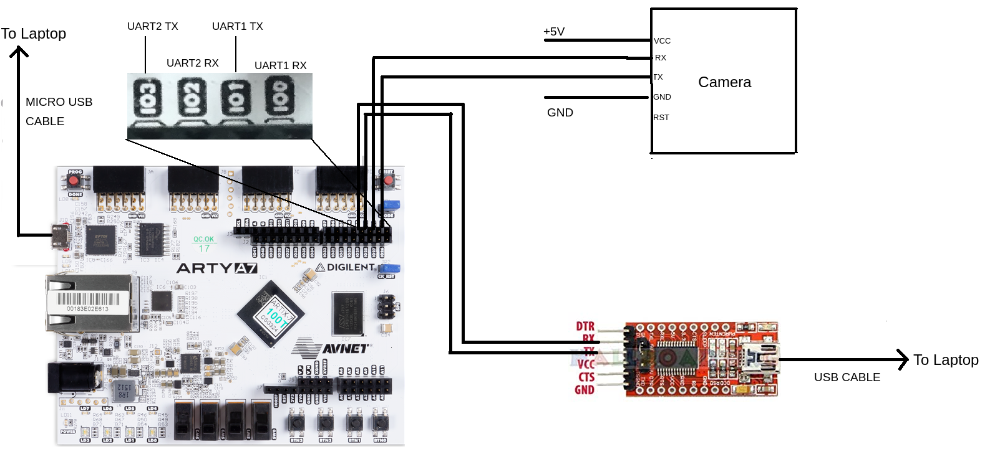

# UCAM_III-driver

A device driver supporting the device UCAM_III camera module. And a sample code to read data sent by Shakti board through UART.

- The details of the camera used are found [here](https://www.mouser.in/ProductDetail/4D-Systems/uCAM-III/?qs=u4fy%2FsgLU9O5RGJ3gXaDIg==),we are interfacing the camera to shakti through UART.
- The user gets the image by connecting the PC to this Shakti board  through UART , by running recieve_img.c in his/her PC.
- We can use ESP8266 Wifi Module to send the image to server on the web , instead of sending to a PC through UART.
- The communication between Host and Camera can be enhanced later. 
- The link for the video which demonstrates the usage of code can be found [here](https://drive.google.com/file/d/1w3pJDkcQUVLvQiVeWUAf1aRZ3ZekajQD/view)   
- Note : Run these two programs (ucam & ucam-test) simultaneously.

Connections :

